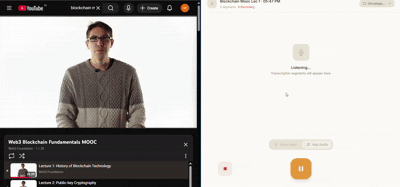

# Polynotes

> Real-time multilingual lecture transcription and note generation — built for how Indian students actually learn.

Polynotes is a cross-platform desktop application that transcribes lectures in real time using on-device ML inference, handles multilingual code-switching common in Indian academic speech, and converts raw transcriptions into structured notes using Gemini or a local LLM — entirely offline-capable.

Built with Tauri 2.0, SolidJS, and Rust. whisper.cpp runs via native FFI — no Python runtime, no cloud dependency, no data leaving your machine.

---

## Demo



---

## Why Polynotes

Indian academic lectures are rarely monolingual. Professors switch naturally between Hindi, English, and regional languages mid-sentence. Existing transcription tools commit to a single language per session and fail on this pattern entirely.

Polynotes is built around this reality — chunked inference with per-segment language detection, WebRTC VAD gating to prevent hallucination on silence, and a note generation pipeline that understands academic structure rather than producing raw transcription dumps.

---

## Features

### Core — Available Now

- **Real-time transcription** via whisper.cpp FFI — no Python, no cloud, runs entirely on device
- **Three-thread architecture** — audio capture, processing, and transcription run on separate threads for non-blocking performance
- **WebRTC VAD gating** — aggressive mode + RMS fallback filters silence before whisper inference
- **Batch audio processing** — processes 10 frames (300ms) at a time for efficiency
- **Push to talk** — configurable hotkey for noisy environments
- **Translate to English** — single inference pass handles both transcription and translation, no separate model required
- **Multilingual support** — Hindi, Bengali, Telugu, Tamil, Odia, and all Whisper multilingual training languages
- **SolidJS reactive UI** — surgical DOM updates for real-time streaming text, no virtual DOM overhead
- **Tauri IPC bridge** — low-latency event stream from Rust backend to frontend
- **First-launch model download** — binary ships under 25mb, model downloaded and cached on first run
- **Cross-platform** — Windows (MSVC) and Linux tested, macOS via GitHub Actions CI, Android target ready

### v1 — In Progress

- **Confusion detection** — whisper confidence scores flag low-certainty segments for review
- **Multilingual code-switching** — per-segment language detection handles mid-sentence language switches
- **Post-class note generation** — Gemini Flash API converts raw transcription to structured markdown notes
- **Export pipeline** — Markdown, PDF, Anki flashcard formats

### v2 — Planned

- **Local LLM note generation** — fully offline via llama.cpp FFI (phi-3-mini-q4)
- **Lecture continuity** — cross-session knowledge graph, contextualizes new lectures against prior material
- **Emphasis detection** — acoustic signals (pause length, amplitude) weight important content higher
- **Exam question prediction** — LLM detects emphasis patterns and generates likely exam questions
- **Android** — Tauri 2.0 Android target, on-device ARM64 inference

---

## Architecture

```
┌─────────────────────────────────────────────────────────────────────────────┐
│                         SolidJS Frontend                                    │
│              Real-time UI · Settings · Transcription Display                 │
└────────────────────────────────┬────────────────────────────────────────────┘
                                 │ Tauri IPC (events: transcription_segment)
┌────────────────────────────────▼────────────────────────────────────────────┐
│                         Rust Backend                                        │
│                                                                             │
│  ┌─────────────────────────────────────────────────────────────────────┐   │
│  │                    Thread 1: Audio Capture                           │   │
│  │  ┌──────────────┐    ┌─────────────────────────────────────────┐   │   │
│  │  │ cpal Input  │ →  │ Convert to i16 + Apply GAIN_FACTOR      │   │   │
│  │  │ (mic/system)│    │ Push to sample_buffer (Arc<Mutex>)      │   │   │
│  │  └──────────────┘    └─────────────────────────────────────────┘   │   │
│  └─────────────────────────────────────────────────────────────────────┘   │
│                                    ↓ sample_buffer                         │
│  ┌─────────────────────────────────────────────────────────────────────┐   │
│  │               Thread 2: Processing Loop (Non-blocking)              │   │
│  │  ┌──────────────┐    ┌──────────────┐    ┌───────────────────┐   │   │
│  │  │ Pop batch    │ →  │ Anti-alias   │ →  │ Resample 48k→16k │   │   │
│  │  │ (10 frames)  │    │ filter       │    │ Linear interp    │   │   │
│  │  └──────────────┘    └──────────────┘    └───────────────────┘   │   │
│  │                                                                   │   │
│  │  ┌──────────────────────────────────────────────────────────────┐  │   │
│  │  │                    VAD + Speech Detection                   │  │   │
│  │  │  • WebRTC VAD (Aggressive mode)                           │  │   │
│  │  │  • RMS fallback (threshold 0.02)                          │  │   │
│  │  │  • Silence threshold: 33 frames (1 second)               │  │   │
│  │  └──────────────────────────────────────────────────────────────┘  │   │
│  │                                    ↓ speech_buffer → channel       │   │
│  └─────────────────────────────────────────────────────────────────────┘   │
│                                    ↓ mpsc channel                         │
│  ┌─────────────────────────────────────────────────────────────────────┐   │
│  │            Thread 3: Transcription (Separate Thread)                 │   │
│  │  ┌──────────────────────────────────────────────────────────────┐  │   │
│  │  │               whisper.cpp (FFI)                               │  │   │
│  │  │  • ggml-base · multilingual · quantized Q5_1               │  │   │
│  │  │  • Single-segment disabled (chunked processing)            │  │   │
│  │  │  • Temperature: 0.2 · no_context: false                   │  │   │
│  │  │  • Threads: num_cpus::get_physical()                     │  │   │
│  │  └──────────────────────────────────────────────────────────────┘  │   │
│  │                                    ↓ emit transcription_segment      │   │
│  └─────────────────────────────────────────────────────────────────────┘   │
└─────────────────────────────────────────────────────────────────────────────┘
```

### Key Optimizations

| Optimization | Description | Impact |
|--------------|-------------|--------|
| **Three-thread model** | Audio capture, processing, and transcription run on separate threads | Non-blocking UI |
| **Batch processing** | Process 10 frames (300ms) at a time | ~3-5x faster audio processing |
| **Dynamic buffer** | Configurable via `POLYNOTES_BUFFER_SECS` env var (default 60s) | Memory efficient |
| **Silence threshold** | 1 second (33 frames) for better accuracy | Improved transcription quality |
| **VAD aggressive mode** | WebRTC VAD in aggressive mode + RMS fallback | Better speech detection |
| **Speed-optimized params** | `single_segment=false`, `temperature_inc=0.2` | Faster inference |

### Crate Structure

```
polynotes/
├── core/                       # Library crate — whisper FFI
│   ├── src/
│   │   ├── lib.rs             # WhisperContext, TranscribeOptions, bindings
│   │   └── tests.rs          # Unit tests
│   ├── build.rs               # bindgen + cc compilation of whisper.cpp
│   └── whisper.cpp/           # whisper.cpp submodule
├── polynotes/                  # Tauri app
│   └── src-tauri/
│       └── src/
│           └── lib.rs         # Audio capture, VAD, processing, transcription
├── Cargo.toml                  # Workspace root (opt-level = 3)
└── .cargo/
    └── config.toml            # WHISPER_MODEL_PATH environment
```
┌─────────────────────────────────────────────────────┐
│                   SolidJS Frontend                  │
│         Real-time UI · Settings · Export            │
└──────────────────────┬──────────────────────────────┘
                       │ Tauri IPC (invoke / events)
┌──────────────────────▼──────────────────────────────┐
│                   Rust Backend                      │
│                                                     │
│  ┌──────────┐  ┌────────────┐  ┌─────────────────┐  │
│  │  Audio   │→ │ WebRTC VAD │→ │ Chunk           │  │
│  │ Capture  │  │   Gate     │  │ Accumulator     │  │
│  └──────────┘  └────────────┘  └───────┬─────────┘  │
│                                        │            │
│  ┌─────────────────────────────────────▼──────────┐ │
│  │            whisper.cpp (FFI)                   │ │
│  │      ggml-base-q5_0 · multilingual             │ │
│  └─────────────────────────────────────┬──────────┘ │
│                                        │            │
│  ┌─────────────────────────────────────▼──────────┐ │
│  │           Note Generation                      │ │
│  │   Implemented later  ·  Local LLM (v2)         │ │
│  └─────────────────────────────────────┬──────────┘ │
│                                        │            │
│  ┌─────────────────────────────────────▼──────────┐ │
│  │         Local Storage (SQLite)                 │ │
│  │   Transcripts · Notes · Course History         │ │
│  └────────────────────────────────────────────────┘ │
└─────────────────────────────────────────────────────┘
```

**Crate structure:**

```
polynotes/
├── core/                  # Library crate — whisper FFI, audio, VAD
│   ├── src/
│   │   ├── lib.rs
│   │   ├── audio.rs       # Audio capture pipeline
│   │   ├── vad.rs         # WebRTC VAD gate
│   │   └── transcribe.rs  # whisper.cpp FFI bindings + inference
│   └── build.rs           # bindgen + cc compilation of whisper.cpp
├── polynotes/             # Tauri app — IPC commands, app shell
│   ├── src/
│   │   └── main.rs
│   └── tauri.conf.json
└── Cargo.toml             # Workspace root
```

---

## Tech Stack

| Layer | Technology |
|-------|-----------|
| Desktop shell | Tauri 2.0 |
| Frontend | SolidJS + TypeScript |
| Backend | Rust |
| ML inference | whisper.cpp via FFI (bindgen + cc) |
| VAD | WebRTC VAD (`webrtc-vad` crate) |
| Model format | GGML quantized (ggml-base-q5_1) |
| Audio processing | cpal + custom resampler |
| Threading | std::thread + mpsc channels |
| Note generation | Gemini Flash API / llama.cpp (v2) |
| Storage | SQLite |
| CI/CD | GitHub Actions (tauri-apps/tauri-action) |

### Build Optimizations

- **opt-level = 3** (speed over size)
- **AVX2 SIMD** for x86_64 builds
- **Native threading** with `num_cpus::get_physical()`

---

## Getting Started

### Prerequisites

- Rust 1.75+
- Node.js 18+
- Tauri CLI v2
- `libclang` (required by bindgen)
- CMake (required to build whisper.cpp)

**Linux (Ubuntu/Debian):**
```bash
sudo apt install libclang-dev cmake pkg-config \
  libwebkit2gtk-4.1-dev libssl-dev libayatana-appindicator3-dev librsvg2-dev
```

**Windows:**
- MSVC Build Tools (Visual Studio 2022)
- CMake via `winget install Kitware.CMake`
- LLVM via `winget install LLVM.LLVM`

### Setup

```bash
git clone --recurse-submodules https://github.com/HrushikeshAnandSarangi/polynotes
cd polynotes
chmod +x setup.sh && ./setup.sh
```

The setup script initializes the whisper.cpp submodule and installs frontend dependencies.

### Model Download

On first launch Polynotes downloads the default model automatically. To download manually:

```bash
mkdir -p core/models
wget https://huggingface.co/ggerganov/whisper.cpp/resolve/main/ggml-base-q5_0.bin \
  -O core/models/ggml-base-q5_0.bin
```

### Run in Development

```bash
cargo tauri dev
```

### Build for Production

```bash
cargo tauri build
```


## License

MIT — see [LICENSE](./LICENSE)

---

*Built at NIT Rourkela. Tested on real lectures.*
