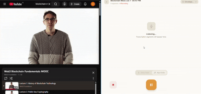

# Polynotes

> Real-time multilingual lecture transcription and note generation — built for how Indian students actually learn.

[](https://github.com/HrushikeshAnandSarangi/polynotes/actions/workflows/build.yml)
[](https://github.com/HrushikeshAnandSarangi/polynotes/releases/latest)
[](./LICENSE)

Polynotes is a cross-platform desktop application that transcribes lectures in real time using on-device ML inference, handles the multilingual code-switching common in Indian academic speech, and converts raw transcriptions into structured notes using Gemini or a local LLM — entirely offline-capable.

Built with Tauri 2.0, SolidJS, and Rust. whisper.cpp runs via native FFI — no Python runtime, no cloud dependency, no data leaving your machine.

---

## Demo



---

## Why Polynotes

Indian academic lectures are rarely monolingual. Professors switch naturally between Hindi, English, and regional languages mid-sentence. Existing transcription tools commit to a single language per session and fail on this pattern entirely.

Polynotes is built around this reality: chunked inference with per-segment language detection, WebRTC VAD gating to prevent hallucination on silence, and a note-generation pipeline that understands academic structure rather than producing raw transcription dumps.

---

## Features

### Core — available now

- **Real-time transcription** via whisper.cpp FFI — no Python, no cloud, runs entirely on device
- **Low latency** — 2-4s end-to-end from speech to transcription display
- **Three-thread architecture** — audio capture, processing, and transcription run on separate threads for non-blocking performance
- **WebRTC VAD gating** — aggressive mode + RMS fallback filters silence before whisper inference
- **Batch audio processing** — processes 10 frames (300ms) at a time for efficiency
- **Push to talk** — configurable hotkey for noisy environments
- **Translate to English** — single inference pass handles both transcription and translation, no separate model required
- **Multilingual support** — Hindi, Bengali, Telugu, Tamil, Odia, and all Whisper multilingual training languages
- **4 model options** — tiny.en, base.en (English-only), tiny, base (multilingual)
- **Speed-optimized inference** — 10-27x realtime with quantized models (see [benchmarks.md](benchmarks.md))
- **SolidJS reactive UI** — surgical DOM updates for real-time streaming text, no virtual DOM overhead
- **Tauri IPC bridge** — low-latency event stream from Rust backend to frontend
- **First-launch model download** — binary ships under 25 MB, model downloaded and cached on first run
- **Cross-platform** — Windows (MSVC) and Linux built and tested in CI; macOS and Android are on the roadmap (see below)

### v1 — in progress

- **Confusion detection** — whisper confidence scores flag low-certainty segments for review
- **Multilingual code-switching** — per-segment language detection handles mid-sentence language switches
- **Post-class note generation** — Gemini Flash API converts raw transcription to structured markdown notes
- **Export pipeline** — Markdown, PDF, Anki flashcard formats

### v2 — planned

- **Local LLM note generation** — fully offline via llama.cpp FFI (phi-3-mini-q4)
- **Lecture continuity** — cross-session knowledge graph, contextualizes new lectures against prior material
- **Emphasis detection** — acoustic signals (pause length, amplitude) weight important content higher
- **Exam question prediction** — LLM detects emphasis patterns and generates likely exam questions
- **macOS and Android** — native builds re-enabled in CI once platform-specific linking is stable

---

## Architecture

```
┌─────────────────────────────────────────────────────────────────────────────┐
│                         SolidJS Frontend                                    │
│              Real-time UI · Settings · Transcription Display                │
└────────────────────────────────┬────────────────────────────────────────────┘
                                  │ Tauri IPC (events: transcription_segment)
┌────────────────────────────────▼────────────────────────────────────────────┐
│                         Rust Backend                                        │
│                                                                               │
│  ┌─────────────────────────────────────────────────────────────────────┐   │
│  │                    Thread 1: Audio Capture                          │   │
│  │  ┌─────────────┐    ┌──────────────────────────────────────────┐   │   │
│  │  │ cpal input  │ →  │ Convert to i16 + apply GAIN_FACTOR        │   │   │
│  │  │ (mic/system)│    │ Push to sample_buffer (Arc<Mutex>)        │   │   │
│  │  └─────────────┘    └──────────────────────────────────────────┘   │   │
│  └─────────────────────────────────────────────────────────────────────┘   │
│                                    │ sample_buffer                          │
│  ┌─────────────────────────────────────────────────────────────────────┐   │
│  │               Thread 2: Processing Loop (non-blocking)               │   │
│  │  ┌──────────────┐    ┌──────────────┐    ┌────────────────────┐    │   │
│  │  │ Pop batch    │ →  │ Anti-alias   │ →  │ Resample 48k → 16k │    │   │
│  │  │ (10 frames)  │    │ filter       │    │ Linear interpolate │    │   │
│  │  └──────────────┘    └──────────────┘    └────────────────────┘    │   │
│  │                                                                     │   │
│  │  ┌──────────────────────────────────────────────────────────────┐  │   │
│  │  │                    VAD + Speech Detection                    │  │   │
│  │  │  • WebRTC VAD (aggressive mode)                               │  │   │
│  │  │  • RMS fallback (threshold 0.02)                              │  │   │
│  │  │  • Silence threshold: 33 frames (1 second)                    │  │   │
│  │  └──────────────────────────────────────────────────────────────┘  │   │
│  │                                    │ speech_buffer → channel       │   │
│  └─────────────────────────────────────────────────────────────────────┘   │
│                                    │ mpsc channel                           │
│  ┌─────────────────────────────────────────────────────────────────────┐   │
│  │            Thread 3: Transcription (separate thread)                │   │
│  │  ┌──────────────────────────────────────────────────────────────┐  │   │
│  │  │               whisper.cpp (FFI)                               │  │   │
│  │  │  • ggml-base.en-q5_1 · English-only · quantized Q5_1          │  │   │
│  │  │  • Single-segment disabled (chunked processing)               │  │   │
│  │  │  • Audio context: 256 · beam_size: 1 · no_context: true       │  │   │
│  │  │  • Threads: num_cpus::get_physical()                          │  │   │
│  │  └──────────────────────────────────────────────────────────────┘  │   │
│  │                                    │ emit transcription_segment    │   │
│  └─────────────────────────────────────────────────────────────────────┘   │
└───────────────────────────────────────────────────────────────────────────┘
```

### Key optimizations

| Optimization | Description | Impact |
|---|---|---|
| Low latency | End-to-end 2-4s from speech to display | Real-time transcription |
| Three-thread model | Audio capture, processing, and transcription run on separate threads | Non-blocking UI |
| Batch processing | Process 10 frames (300ms) at a time | ~3-5x faster audio processing |
| Dynamic buffer | Configurable via `POLYNOTES_BUFFER_SECS` env var (default 60s) | Memory efficient |
| Silence threshold | 1 second (33 frames) for better accuracy | Improved transcription quality |
| VAD aggressive mode | WebRTC VAD in aggressive mode + RMS fallback | Better speech detection |
| Speed-optimized params | `audio_ctx=256`, `beam_size=1`, `no_context=true`, `language=en` | 10-27x realtime |
| English-only models | `.en` models skip language detection | ~2x faster than multilingual |

### Crate structure

```
polynotes/
├── core/                        # Library crate — whisper FFI
│   ├── src/
│   │   ├── lib.rs               # WhisperContext, TranscribeOptions
│   │   ├── bindings.rs          # Generated whisper.cpp FFI bindings
│   │   └── tests.rs             # Unit tests
│   ├── build.rs                 # bindgen + cc compilation of whisper.cpp/ggml
│   └── whisper.cpp/             # whisper.cpp submodule
├── polynotes/                   # Tauri app
│   ├── src/                     # SolidJS frontend
│   └── src-tauri/
│       └── src/
│           ├── lib.rs           # Audio capture, VAD, processing, transcription
│           ├── main.rs          # App entry point
│           └── benchmark.rs     # Standalone benchmark binary
├── Cargo.toml                   # Workspace root (opt-level = 3, shared target/)
└── .cargo/
    └── config.toml              # WHISPER_MODEL_PATH environment
```

---

## Tech Stack

| Layer | Technology |
|---|---|
| Desktop shell | Tauri 2.0 |
| Frontend | SolidJS + TypeScript |
| Backend | Rust |
| ML inference | whisper.cpp via FFI (bindgen + cc) |
| VAD | WebRTC VAD (`webrtc-vad` crate) |
| Model format | GGML quantized (`ggml-base.en-q5_1`) |
| Audio processing | cpal + custom resampler |
| Threading | `std::thread` + `mpsc` channels |
| Note generation | Gemini Flash API today, llama.cpp planned for v2 |
| Storage | SQLite |
| CI/CD | GitHub Actions, tag-triggered releases |

### Build optimizations

- `opt-level = 3` (speed over size)
- AVX2 SIMD for x86_64 builds
- Native threading via `num_cpus::get_physical()`

---

## Getting Started

### Prerequisites

- Rust 1.75+
- Node.js 18+ (or Bun, which the project uses)
- Tauri CLI v2
- `libclang` (required by bindgen)
- CMake (required to build whisper.cpp)

**Linux (Ubuntu/Debian):**
```bash
sudo apt install libclang-dev cmake pkg-config \
  libwebkit2gtk-4.1-dev libssl-dev libayatana-appindicator3-dev librsvg2-dev
```

**Windows:**
- MSVC Build Tools (Visual Studio 2022)
- CMake via `winget install Kitware.CMake`
- LLVM via `winget install LLVM.LLVM`

### Setup

```bash
git clone --recurse-submodules https://github.com/HrushikeshAnandSarangi/polynotes
cd polynotes
chmod +x setup.sh && ./setup.sh
```

The setup script initializes the whisper.cpp submodule and downloads the recommended models.

### Nix development (Linux)

If you have Nix with flakes enabled, the provided development shell handles everything:

```bash
nix develop .          # enter dev environment (auto-downloads models on first run)
nix build               # build the app
cargo run --release --bin benchmark
```

The flake provides the Rust toolchain (via rust-overlay), Bun, the Tauri CLI, and all native build dependencies (cmake, clang, libclang, webkit2gtk, gtk3, etc).

### Model download

On first launch Polynotes downloads the default model automatically. To fetch a specific model manually:

**English-only (faster):**
```bash
cd core/whisper.cpp/models
bash download-ggml-model.sh tiny.en-q5_1   # 30 MB — fastest
bash download-ggml-model.sh base.en-q5_1   # 76 MB — balanced
```

**Multilingual:**
```bash
cd core/whisper.cpp/models
bash download-ggml-model.sh tiny-q5_1   # 32 MB — fastest
bash download-ggml-model.sh base-q5_1   # 60 MB — balanced
```

Or just run `./setup.cmd` (Windows) / `bash setup.sh` (Linux/macOS) to fetch all four recommended models at once.

### Run in development

```bash
cd polynotes
bun install
bun tauri dev
```

### Build for production

```bash
cd polynotes
bun tauri build
```

Release builds are also produced automatically by CI on every `vX.Y.Z` tag — see [Releases](https://github.com/HrushikeshAnandSarangi/polynotes/releases).

---

## Benchmarks

On an AMD Ryzen 5 5600H, Polynotes' batch pipeline hits **10-27x realtime** depending on model, and the full VAD-gated production pipeline delivers **2-4s end-to-end latency** from speech to on-screen transcription.

Full methodology, per-model numbers, and the batch-vs-streaming tradeoff are in [benchmarks.md](benchmarks.md).

---

## License

MIT — see [LICENSE](./LICENSE)

---

*Built at NIT Rourkela. Tested on real lectures.*
