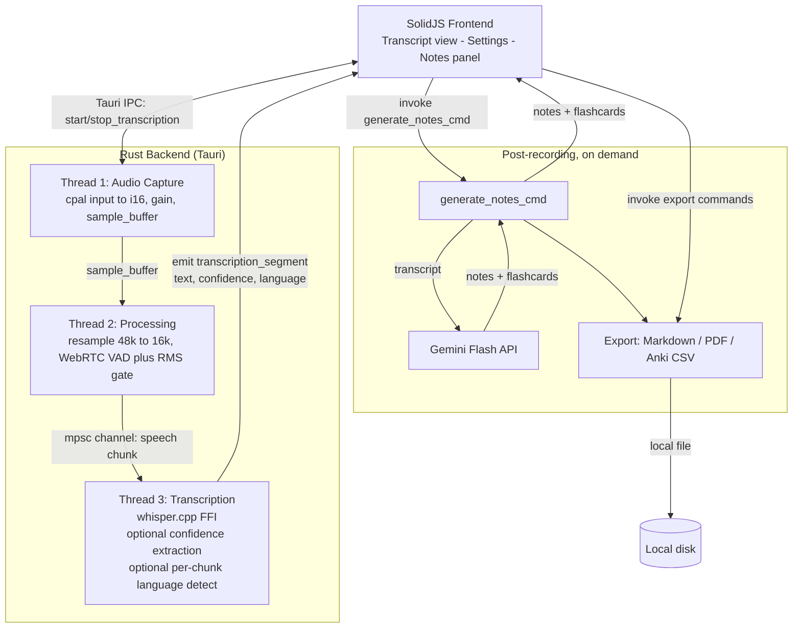

# Polynotes

> Real-time multilingual lecture transcription and note generation — built for how Indian students actually learn.

[](https://github.com/HrushikeshAnandSarangi/polynotes/actions/workflows/build.yml)
[](https://github.com/HrushikeshAnandSarangi/polynotes/releases/latest)
[](./LICENSE)

Polynotes is a cross-platform desktop application that transcribes lectures in real time using on-device ML inference and handles the multilingual code-switching common in Indian academic speech. Transcription itself is fully offline — no Python runtime, no cloud dependency, no audio leaving your machine. Turning that transcript into structured notes and flashcards is optional and uses the Gemini Flash API, so it needs your own API key and network access.

Built with Tauri 2.0, SolidJS, and Rust. whisper.cpp runs via native FFI.

---

## Demo


---

## Why Polynotes

Indian academic lectures are rarely monolingual. Professors switch naturally between Hindi, English, and regional languages mid-sentence. Existing transcription tools commit to a single language per session and fail on this pattern entirely.

Polynotes is built around this reality: chunked inference with per-segment language detection, WebRTC VAD gating to prevent hallucination on silence, and a note-generation pipeline that understands academic structure rather than producing raw transcription dumps.

---

## Features

### Transcription

- **Real-time transcription** via whisper.cpp FFI — no Python, no cloud, runs entirely on device
- **Low latency** — 2-4s end-to-end from speech to transcription display
- **Three-thread architecture** — audio capture, processing, and transcription run on separate threads for non-blocking performance
- **WebRTC VAD gating** — aggressive mode + RMS fallback filters silence before whisper inference
- **Batch audio processing** — processes 10 frames (300ms) at a time for efficiency
- **Push to talk** — configurable hotkey for noisy environments
- **Translate to English** — single inference pass handles both transcription and translation, no separate model required
- **Multilingual support** — Hindi, Bengali, Telugu, Tamil, Odia, and all Whisper multilingual training languages
- **4 model options** — tiny.en, base.en (English-only), tiny, base (multilingual)
- **Speed-optimized inference** — 10-27x realtime with quantized models (see [benchmarks.md](benchmarks.md))
- **Confusion detection** — per-segment average token confidence flags low-certainty lines for review in the transcript view. Cheap (no extra inference pass — see benchmarks.md), on by default, toggleable in Settings. The flagging threshold is a heuristic, not validated against a labeled dataset.
- **Multilingual code-switching** — optional per-chunk language auto-detection for lectures that switch languages mid-session. Unlike confidence extraction this has a real, measured cost (see benchmarks.md), so it's a Settings opt-in, off by default.

### Notes and export

- **Post-class note generation** — sends the raw transcript to the Gemini Flash API and gets back structured Markdown notes plus flashcards. Requires your own Gemini API key (Settings) and network access; the key is stored locally and never leaves your machine except to call Google's API.
- **Export pipeline** — Markdown and PDF export of generated notes, plus an Anki-compatible **CSV** export for flashcards (not a native `.apkg` package — Anki's own File → Import dialog accepts plain CSV directly; map the two columns to Front/Back).

### Platform and infrastructure

- **SolidJS reactive UI** — surgical DOM updates for real-time streaming text, no virtual DOM overhead
- **Tauri IPC bridge** — low-latency event stream from Rust backend to frontend
- **First-launch model download** — binary ships under 25 MB, model downloaded and cached on first run
- **Cross-platform** — Windows (MSVC) and Linux built and tested in CI today; macOS and Android are not currently built (disabled pending platform-specific linking work)
- **Tag-triggered release CI** — every `vX.Y.Z` tag builds, tests, and publishes a GitHub Release automatically

---

## Architecture


```mermaid
flowchart TD
    UI["SolidJS Frontend<br/>Transcript view - Settings - Notes panel"]

    subgraph BE["Rust Backend (Tauri)"]
        direction TB
        T1["Thread 1: Audio Capture<br/>cpal input to i16, gain, sample_buffer"]
        T2["Thread 2: Processing<br/>resample 48k to 16k, WebRTC VAD plus RMS gate"]
        T3["Thread 3: Transcription<br/>whisper.cpp FFI<br/>optional confidence extraction<br/>optional per-chunk language detect"]
        T1 -->|sample_buffer| T2
        T2 -->|mpsc channel: speech chunk| T3
    end

    subgraph POST["Post-recording, on demand"]
        GEN["generate_notes_cmd"]
        GEMINI["Gemini Flash API"]
        EXP["Export: Markdown / PDF / Anki CSV"]
        GEN -->|transcript| GEMINI
        GEMINI -->|notes + flashcards| GEN
        GEN --> EXP
    end

    UI <-->|Tauri IPC: start/stop_transcription| T1
    T3 -->|emit transcription_segment<br/>text, confidence, language| UI
    UI -->|invoke generate_notes_cmd| GEN
    GEN -->|notes + flashcards| UI
    UI -->|invoke export commands| EXP
    EXP -->|local file| DISK[("Local disk")]
```

The VAD gate (WebRTC VAD aggressive mode + RMS fallback, 33-frame/1s silence threshold) and the confidence/language options on Thread 3 are what the [Key optimizations](#key-optimizations) and [benchmarks.md](benchmarks.md) tables below quantify.

### Key optimizations

| Optimization | Description | Impact |
|---|---|---|
| Low latency | End-to-end 2-4s from speech to display | Real-time transcription |
| Three-thread model | Audio capture, processing, and transcription run on separate threads | Non-blocking UI |
| Batch processing | Process 10 frames (300ms) at a time | ~3-5x faster audio processing |
| Dynamic buffer | Configurable via `POLYNOTES_BUFFER_SECS` env var (default 60s) | Memory efficient |
| Silence threshold | 1 second (33 frames) for better accuracy | Improved transcription quality |
| VAD aggressive mode | WebRTC VAD in aggressive mode + RMS fallback | Better speech detection |
| Speed-optimized params | `audio_ctx=256`, `beam_size=1`, `no_context=true`, `language=en` | 10-27x realtime |
| English-only models | `.en` models skip language detection | ~2x faster than multilingual |
| Confidence extraction (opt-in, app default **on**) | Mean token probability per segment | ~0% overhead — see benchmarks.md |
| Language auto-detect (opt-in, **off** by default) | Per-chunk `whisper_lang_auto_detect` | +40-70% inference time — see benchmarks.md |

### Crate structure

```
polynotes/
├── core/                        # Library crate — whisper FFI
│   ├── src/
│   │   ├── lib.rs               # WhisperContext, TranscribeOptions, Segment
│   │   ├── bindings.rs          # Generated whisper.cpp FFI bindings
│   │   └── tests.rs             # Unit tests
│   ├── build.rs                 # bindgen + cc compilation of whisper.cpp/ggml
│   └── whisper.cpp/             # whisper.cpp submodule
├── polynotes/                   # Tauri app
│   ├── src/                     # SolidJS frontend
│   │   └── pages/                # HomePage, NotePage, SettingsPage, NotesPanel
│   └── src-tauri/
│       └── src/
│           ├── lib.rs           # Composition root — command registration only
│           ├── transcription.rs # Audio capture, VAD, processing, transcription
│           ├── models.rs        # Whisper model selection/download
│           ├── gemini.rs        # Gemini Flash note generation
│           ├── export.rs        # Markdown / PDF / Anki CSV export
│           ├── main.rs          # App entry point
│           └── benchmark.rs     # Standalone benchmark binary
├── Cargo.toml                   # Workspace root (opt-level = 3, shared target/)
└── .cargo/
    └── config.toml              # WHISPER_MODEL_PATH environment
```

---

## Tech Stack

| Layer | Technology |
|---|---|
| Desktop shell | Tauri 2.0 |
| Frontend | SolidJS + TypeScript |
| Backend | Rust |
| ML inference | whisper.cpp via FFI (bindgen + cc) |
| VAD | WebRTC VAD (`webrtc-vad` crate) |
| Model format | GGML quantized (`ggml-base.en-q5_1`) |
| Audio processing | cpal + custom resampler |
| Threading | `std::thread` + `mpsc` channels |
| Note generation | Gemini Flash API (user-supplied key, requires network) |
| Note export | `printpdf` (HTML-to-PDF) for PDF, `csv` for Anki-compatible CSV |
| Storage | Browser `localStorage` (notes, folders, settings) |
| CI/CD | GitHub Actions, tag-triggered releases |

### Build optimizations

- `opt-level = 3` (speed over size)
- AVX2 SIMD for x86_64 builds
- Native threading via `num_cpus::get_physical()`

---

## Getting Started

### Prerequisites

- Rust 1.75+
- Node.js 18+ (or Bun, which the project uses)
- Tauri CLI v2
- `libclang` (required by bindgen)
- CMake (required to build whisper.cpp)

**Linux (Ubuntu/Debian):**
```bash
sudo apt install libclang-dev cmake pkg-config \
  libwebkit2gtk-4.1-dev libssl-dev libayatana-appindicator3-dev librsvg2-dev
```

**Windows:**
- MSVC Build Tools (Visual Studio 2022)
- CMake via `winget install Kitware.CMake`
- LLVM via `winget install LLVM.LLVM`

### Setup

```bash
git clone --recurse-submodules https://github.com/HrushikeshAnandSarangi/polynotes
cd polynotes
chmod +x setup.sh && ./setup.sh
```

The setup script initializes the whisper.cpp submodule and downloads the recommended models.

### Nix development (Linux)

If you have Nix with flakes enabled, the provided development shell handles everything:

```bash
nix develop .          # enter dev environment (auto-downloads models on first run)
nix build               # build the app
cargo run --release --bin benchmark
```

The flake provides the Rust toolchain (via rust-overlay), Bun, the Tauri CLI, and all native build dependencies (cmake, clang, libclang, webkit2gtk, gtk3, etc).

### Model download

On first launch Polynotes downloads the default model automatically. To fetch a specific model manually:

**English-only (faster):**
```bash
cd core/whisper.cpp/models
bash download-ggml-model.sh tiny.en-q5_1   # 30 MB — fastest
bash download-ggml-model.sh base.en-q5_1   # 76 MB — balanced
```

**Multilingual:**
```bash
cd core/whisper.cpp/models
bash download-ggml-model.sh tiny-q5_1   # 32 MB — fastest
bash download-ggml-model.sh base-q5_1   # 60 MB — balanced
```

Or just run `./setup.cmd` (Windows) / `bash setup.sh` (Linux/macOS) to fetch all four recommended models at once.

### Run in development

```bash
cd polynotes
bun install
bun tauri dev
```

### Build for production

```bash
cd polynotes
bun tauri build
```

Release builds are also produced automatically by CI on every `vX.Y.Z` tag — see [Releases](https://github.com/HrushikeshAnandSarangi/polynotes/releases).

### Note generation (optional)

Post-class note generation and export need a Gemini API key. Get one at [aistudio.google.com/apikey](https://aistudio.google.com/apikey), then paste it into Settings → AI Notes. The key is stored only in the app's local settings and is sent only to Google's Gemini API when you generate notes — never anywhere else.

---

## Benchmarks

On an AMD Ryzen 5 5600H, Polynotes' batch pipeline hits **10-27x realtime** depending on model, and the full VAD-gated production pipeline delivers **2-4s end-to-end latency** from speech to on-screen transcription. Confidence extraction (on by default) costs effectively nothing (within run-to-run noise); language auto-detection (off by default) adds a real **+40-70%** to inference time depending on model, which is exactly why it's opt-in.

Full methodology, per-model numbers, the batch-vs-streaming tradeoff, export-generation timings, and an explicit note on what's *not* benchmarked (accuracy/quality — no labeled dataset exists) are all in [benchmarks.md](benchmarks.md).

---

## License

MIT — see [LICENSE](./LICENSE)

---

*Built at NIT Rourkela. Tested on real lectures.*
